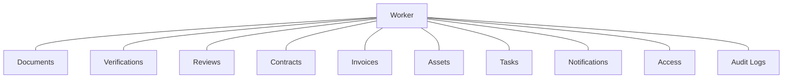

# 02 · PRODUCT BLUEPRINT

## Vision

One platform that owns the worker journey from the moment an offer is accepted to the moment the record is deleted. It integrates with the systems already in place rather than replacing them.

> In one line: Zoho hires them, Gusto pays the US ones, WOP runs everything in between for everyone else.

---

## Scope

| In scope (WOP owns) | Out of scope (stays elsewhere) |
|---------------------|--------------------------------|
| Worker creation and profile | Job posting, interviews, offer (Zoho Recruit) |
| Onboarding and document collection | US payroll, tax, benefits (Gusto) |
| Verification and compliance | Salary disbursement and accounting (finance) |
| Activation and access checklist tracking | Actual account creation in Google, GitHub, Slack (done by IT, ticked off in WOP) |
| Active records, contracts, reviews, assets | Rating policy (HR decides, WOP records) |
| Offboarding, reporting, notifications | Statutory filings |

---

## The core principle

**Everything attaches to the Worker.** One worker, many attached modules. This single idea drives the database, the permissions and the screens.

The one thing to remember about the architecture: this picture. Detail is in [Database Architecture](07-database-architecture.md).

---

## Worker types

Worker type drives the document checklist, the verification checklist, the agreements required and the lifecycle track.

| Type | Documents | Agreements | Track |
|------|-----------|------------|-------|
| Indian employee | Aadhaar, PAN, degree, experience, relieving, bank proof | NDA, employment | Probation reviews |
| Indian contractor | Aadhaar, PAN, bank proof | NDA, contractor, SOW | Contract lifecycle |
| Global contractor | Passport, tax ID, international banking | NDA, contractor, SOW | Contract lifecycle |
| Global intern | Passport, student ID, enrollment, university letter | NDA, internship | Mentorship and reviews |

---

## Capabilities at a glance

Twelve modules, grouped by what they do. Full detail in [Functional Modules](05-functional-modules.md).

| Group | Modules |
|-------|---------|
| Bring them in | 1 Worker Creation, 2 Document Management |
| Check and activate | 3 Verification Engine, 4 Compliance Engine, 5 Access Management |
| Run the workforce | 6 Workforce Directory, 7 Contract Lifecycle, 8 Performance, 9 Asset Management |
| Exit and oversee | 10 Offboarding, 11 Notification Engine, 12 Reporting and Analytics |

---

## Why custom, not off the shelf

A fair question from any founder. The honest version:

- Tools like Deel or Rippling are strong but priced per worker per month and KATBOTZ adapts to their workflow.
- Indian HRMS tools (Darwinbox, Keka, Zoho People) are built around full time Indian employees, not a mixed contractor, intern and global workforce with custom verification and access tracking.
- A thin custom layer that orchestrates Zoho and Gusto fits the exact KATBOTZ flow, keeps one home for all four worker types, and KATBOTZ owns the data and the roadmap.

> **Confirmed:** custom build on Google Cloud. Full rationale is in [00 Proposal and Approval](00-proposal-and-approval.md), Decision 1.
