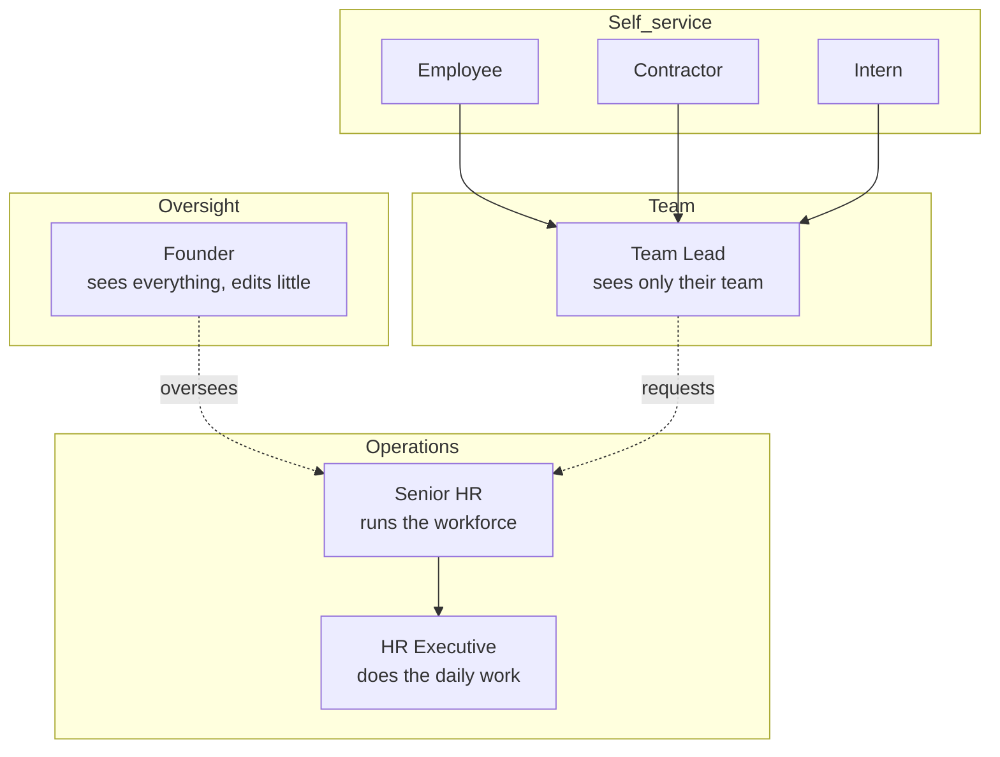

# 03 · USER ROLES AND EXPERIENCES

> Same application. Different permissions. **A different system for every person who logs in.**

The screen a Founder sees and the screen an Intern sees share almost no pixels. Role based access control decides what data each person can reach, and the interface is then shaped around the job that person actually does. This document describes each experience end to end.

---

## The seven people

---

## Permission matrix

Read this as the source of truth for who can do what. `Yes` = full, `Limited` = scoped to their own people or records, `No` = not available.

| Capability | Founder | Senior HR | HR Exec | Team Lead | Employee | Contractor | Intern |
|------------|:-------:|:---------:|:-------:|:-------:|:--------:|:----------:|:------:|
| View all workers | Yes | Yes | Yes | No | No | No | No |
| View own team | Yes | Yes | Yes | Yes | No | No | No |
| View own record | Yes | Yes | Yes | Yes | Yes | Yes | Yes |
| Create worker | No | Yes | No | No | No | No | No |
| Verify documents | No | Yes | Limited (review only) | No | No | No | No |
| Request corrections | No | Yes | Yes | No | No | No | No |
| Activate worker | No | Yes | No | No | No | No | No |
| Offboard worker | No | Yes | No | Limited (request) | No | No | No |
| Submit reviews | No | Yes | No | Yes | No | No | No |
| Approve reviews | No | Yes | No | Yes | No | No | No |
| Manage contracts | No | Yes | Limited (track) | No | No | No | No |
| Manage assets | No | Yes | Limited (track) | No | No | No | No |
| Generate reports | Yes | Yes | No | No | No | No | No |
| Upload own documents | No | No | No | No | Yes | Yes | Yes |
| Submit invoices | No | No | No | No | No | Yes | No |

> **Confirmed:** HR Executive can review and flag only. Verification and activation are reserved for Senior HR.

---

## Founder

**Purpose:** organization wide visibility. Reads the company, does not run it.

**What they see:** a single executive dashboard.

- Total workforce, split into employees, contractors, interns
- Growth trend over time
- Contract expiry risk
- Pending onboarding
- Compliance issues
- Upcoming exits

**Can do:** view everything, generate reports.

**Cannot do:** create, verify, activate or offboard. The Founder is not in the operational path.

**The experience:** the Founder logs in maybe once a week. They want one screen that answers "is the workforce healthy and is anything on fire". No worker level clicking unless they choose to drill in. The whole interface is numbers, trends and risk flags, not task queues.

---

## Senior HR

**Purpose:** own workforce operations. This is the most powerful operational role.

**What they see:** the operations cockpit.

- Pending documents
- Pending verification
- Pending activations
- Contract renewals
- Upcoming reviews
- Recent activity feed

**Can do:** create workers, verify documents, activate workers, offboard workers, generate reports. Everything across every worker.

**Cannot do:** nothing is hidden from Senior HR within workforce operations.

**The experience:** this person lives in WOP all day. The interface is a set of work queues that should trend toward empty. The defining moment is **activation**: Senior HR is the only role that flips a worker from compliant to active, which gives a clean, auditable point where a worker officially joins.

---

## HR Executive

**Purpose:** execute the daily operations that keep onboarding moving.

**What they see:** worker records, documents, tasks, contracts.

**Can do:** review documents, request corrections, track onboarding, track offboarding.

**Cannot do:** **activate workers.** That line is deliberate. The Executive prepares and checks, Senior HR approves and activates. This is the maker and checker split.

**The experience:** a focused task list. Open a worker, review what they uploaded, accept or send back with a reason, move to the next. They feel the system as a queue of documents to clear, not a place where final decisions are made.

---

## Team Lead

**Purpose:** manage direct reports, and only direct reports.

**What they see:** their team, nothing else.

> Example: a team lead with 10 engineers, 2 interns and 1 contractor sees exactly those 13 people. Other teams are invisible.

**Can do:** submit reviews, approve team reviews, track team onboarding, initiate an offboarding request.

**Cannot do:** view other teams, or offboard directly. Offboarding is a request that Senior HR completes.

**The experience:** a small, personal dashboard scoped to their people. The team lead never feels the size of the company. They see who on their team is onboarding, whose review is due, and whose contract is near expiry. Their main action is reviews.

---

## Employee

**Purpose:** complete onboarding, then keep their own record current.

**What they see:** their own world only.

| Panel | Contents |
|-------|----------|
| My Profile | Name, department, manager, role, joining date |
| My Documents | PAN, Aadhaar, degree, agreement |
| My Reviews | 30 day, 60 day, 90 day, annual |
| My Assets | Laptop, monitor |
| My Tasks | Upload documents, sign agreements, complete training |

**Can do:** upload documents, sign agreements, complete tasks.

**Cannot do:** see anyone else. Full stop.

**The experience:** the first week is a guided checklist that tells them exactly what is missing and nudges them until it is done. After that, WOP is quiet: a place they visit to see a review or check an asset. It should feel like a personal portal, never like an HR tool.

---

## Contractor

**Purpose:** deliver work, get paid, stay current. A different interface from an employee.

**What they see:**

| Panel | Contents |
|-------|----------|
| Contract | Start date, end date, renewal date |
| Invoices | Submitted, approved, paid |
| Documents | PAN, agreement, SOW |
| Tasks | Submit invoice, upload documents |

**Can do:** submit invoices, upload documents.

**Cannot do:** anything employee or team related. No reviews, no directory.

**The experience:** the contractor cares about two things, is my contract current and did my invoice get paid. The interface leads with the contract clock and the invoice status, so both answers are visible the moment they log in.

---

## Intern

**Purpose:** learn, be reviewed, possibly convert. A lighter, learning shaped interface.

**What they see:**

| Panel | Contents |
|-------|----------|
| Internship | Mentor, duration, department |
| Reviews | Weekly, monthly, PPO recommendation |
| Learning | Assigned tasks, learning goals |

**Can do:** upload documents, complete learning tasks.

**Cannot do:** anything beyond their own internship.

**The experience:** softer and more guided than the employee view. The intern sees their mentor, their schedule of reviews, and a learning track. The PPO recommendation is the milestone the whole experience builds toward.

---

## How one event looks to four people

A single action, a document being verified, is felt differently depending on who you are. This is the whole point of role based experience.

| Person | What they experience |
|--------|----------------------|
| Employee | "Your PAN was accepted." One task disappears from their checklist. |
| HR Executive | They were the one who reviewed it and cleared it from their queue. |
| Senior HR | The worker moved one step closer to being ready for activation. |
| Founder | The compliance issues counter on the dashboard ticked down by one. |

> **Confirmed:** Founder access is read plus reports — view everything, generate and export reports, no operational actions.
