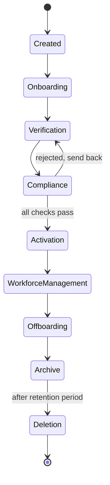

# 04 · Workforce Lifecycle

Every worker follows a defined lifecycle. The platform always knows which stage a worker is in, and the stage controls what actions are allowed.

---

## Stage 1 · Created

- **Who acts:** Senior HR
- **Trigger:** offer accepted in Zoho, HR clicks Create Worker
- **System generates:** Worker ID, profile, tasks, document checklist, verification checklist
- **Exit when:** the worker record and workspace exist, ready to invite

## Stage 2 · Onboarding

- **Who acts:** the worker (self service)
- **Trigger:** worker receives portal access
- **Worker does:** uploads documents, signs agreements, completes profile
- **Exit when:** every required item in the checklist is submitted

## Stage 3 · Verification

- **Who acts:** Senior HR (HR Executive reviews and flags)
- **Checks, manually:** PAN, Aadhaar, passport, education, employment, banking
- **Status per item:** Pending, Verified, Rejected
- **On reject:** a correction request goes to the worker, and the stage holds
- **Exit when:** every required check is Verified

## Stage 4 · Compliance

- **Who acts:** the system
- **Checks:** documents complete, verification complete, agreements signed
- **Exit when:** all three are true, which marks the worker ready for activation

## Stage 5 · Activation

- **Who acts:** Senior HR
- **Trigger:** Senior HR activates the worker (a deliberate, approved step)
- **Result:** the worker becomes Active, and access provisioning begins
- **Why a separate stage:** it gives one clean, auditable point where a worker officially joins

## Stage 6 · Workforce Management

- **Who acts:** managers, HR, the worker
- **The worker operates normally:** reviews, promotions, contract renewals, assets
- **Exit when:** an exit is initiated

## Stage 7 · Offboarding

- **Who acts:** Senior HR (managers can request it)
- **Trigger:** exit initiated
- **System generates:** an exit checklist covering access revocation, asset return, exit documents
- **Exit when:** every checklist item is closed

## Stage 8 · Archive

- **Who acts:** the system
- **Result:** the worker is archived, the record is retained for audit and history
- **Retention clock starts here**

## Stage 9 · Deletion

- **Who acts:** the system, on schedule
- **After the retention period:** delete documents, personal data and banking data
- **Keep:** anonymized analytics only

> **EDIT ME:** the retention period. This document assumes **3 years** after archival, per the source notes. Confirm against the DPDP position in [Security and Compliance](08-security-and-compliance.md).

---

## Status values, summarized

| Stage | Worker status |
|-------|---------------|
| 1 | Created |
| 2 | Onboarding |
| 3 | Verification (Pending / Verified / Rejected per item) |
| 4 | Compliance review |
| 5 | Activation |
| 6 | Active |
| 7 | Offboarding |
| 8 | Archived |
| 9 | Deleted (analytics retained) |
