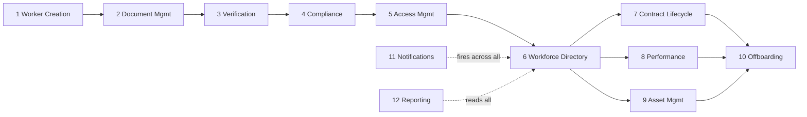

# 05 · Functional Modules

Twelve modules. Each does one job and hands off to the next, which is what turns a set of features into a single workflow.

---

## How they connect

Module 11 (Notifications) and Module 12 (Reporting) are cross cutting: they sit beside every stage rather than inside one.

---

## Module 1 · Worker Creation

- **Purpose:** create the workforce record once an offer is accepted
- **Input:** name, contact, worker type, department, team lead, joining date
- **Output:** Worker ID, profile, type-specific checklist of tasks and documents to complete
- **Roles:** Senior HR

## Module 2 · Document Management

- **Purpose:** collect and store every document
- **Stores:** PAN, Aadhaar, passport, agreements, certificates
- **Output:** a complete, per worker document set, files in Cloud Storage, metadata in Firestore
- **Roles:** worker uploads, HR reviews
- **If upload fails (network error, file too large, etc.):**
  - Error message shown to worker in portal with reason (e.g. "File too large. Max 10 MB.")
  - Firestore records the failed attempt in audit log
  - Document status stays "Not uploaded yet"
  - Worker can retry immediately (no cooldown)
  - No email notification for failures (worker sees error in real time)

## Module 3 · Verification Engine

- **Purpose:** store all uploaded documents and track manual verification status — nothing happens to the documents themselves, they are stored as-is
- **How it works:** 
  - Worker uploads PAN, Aadhaar image, passport, etc. Files are saved in Cloud Storage in their original form — no processing, no extraction, no transformation
  - Senior HR sees a verification queue showing all documents per worker
  - Senior HR opens each document (image viewer for Aadhaar, PDF viewer for others), checks it visually, and marks one of: ☑ Verified, ☐ Rejected
  - If rejected, HR provides reason (e.g. "blurry", "missing signature") — reason is emailed to worker automatically
  - If approved, document status moves to Verified; worker sees green checkmark in their portal
- **Status per document:** ○ Pending (uploaded, not reviewed yet), ☑ Verified (HR approved), ✗ Rejected (HR rejected, worker must re-upload)
- **What does NOT happen:** No automated KYC, no API calls to verify documents, no extraction of Aadhaar number, no processing. Just storage + manual review + status tracking.
- **Roles:** Senior HR does all verification; HR Executive can view but does not verify

## Module 4 · Compliance Engine

- **Purpose:** automatic gate — checks if all requirements are met before a worker can be activated
- **What it checks:**
  - ☑ All required documents uploaded (e.g. PAN, Aadhaar image, degree — depends on worker type)
  - ☑ All documents verified (every document status is ☑ Verified, none are ○ Pending or ✗ Rejected)
  - ☑ All required agreements signed (employment agreement, NDA, etc.)
- **Output:** 
  - If ALL boxes ☑: "Ready for activation" — Senior HR can now activate the worker
  - If ANY box ☐: Shows exactly which documents are missing or which are still pending/rejected, what agreements are not signed. Worker and HR both see this list.
- **No manual intervention:** This is automatic. The system checks the checklist status in real time. No HR action needed.
- **Roles:** System only (no role interaction)

## Module 5 · Access Management

- **Purpose:** track that each required system account has been manually created for a worker — by recording a checklist of what was done in each system
- **How it works:** 
  - When a worker is activated, a **Checklist** appears in their record showing required systems per role/worker type
  - The checklist shows: Google Workspace, GitHub (KATBOTZ org), Slack, any internal tools
  - For EACH system, Senior HR or an IT person:
    1. Creates the account manually in that system (Google Workspace admin, GitHub settings, Slack admin, etc.) — WOP does NOT create accounts
    2. Returns to WOP and ticks ☑ Done in the checklist
    3. Enters the created ID (e.g. rohan@katbotz.com, rohan-github, rohan.slack) so it's recorded
  - **Status per system:** ☐ Pending (not done yet), ☑ Done (account created, ID recorded)
  - If a system is not relevant for this worker type, HR can skip it or mark Not Applicable
  - Checklist is **not complete** until all required boxes are ☑ Done
- **At offboarding:** the same checklist reappears as a **Revocation Checklist** — for each system, HR:
  1. Removes/disables the account manually in that system
  2. Returns to WOP and ticks ☑ Revoked
  3. Records the revocation date
- **Cannot close offboarding** until all revocation boxes are ☑ Revoked
- **Manual creation rule:** WOP records what was done. It does NOT provision accounts, send invites, or create users in any external system. That is always manual IT work.
- **Roles:** Senior HR manages the checklist; IT person who creates accounts ticks it off

## Module 6 · Workforce Directory

- **Purpose:** the searchable single source of truth for active workers
- **Holds:** current details, department, team lead, location, status, projects
- **Output:** find any worker, see current state and full history
- **Roles:** HR full, Team Lead scoped to team

## Module 7 · Contract Lifecycle

- **Purpose:** manage contractor engagements so none lapses unnoticed
- **Tracks:** SOW, invoices, renewals, expiry alerts at 90, 60, 30, 7 days
- **Output:** live contract status and an end to end invoice flow
- **Roles:** HR manages, contractor submits invoices

## Module 8 · Performance Management

- **Purpose:** track the right reviews for each worker type, on schedule
- **Employee:** 30, 60, 90 day, probation, annual
- **Intern:** weekly, monthly, PPO recommendation
- **Contractor:** delivery evaluation, renewal recommendation
- **Roles:** Team Lead submits, Senior HR oversees

## Module 9 · Asset Management

- **Purpose:** track what hardware a worker holds
- **Tracks:** laptop, monitor, SIM, accessories
- **Output:** a per worker asset list, reconciled at exit
- **Roles:** HR manages

## Module 10 · Offboarding

- **Purpose:** run a clean exit with nothing left open
- **Tracks:** access revocation, asset return, exit documents
- **Rule:** cannot close while any access or asset remains outstanding
- **Roles:** Senior HR runs, Team Lead can request

## Module 11 · Notification Engine

- **Purpose:** send exactly 5 automated reminder emails at specific moments — nothing else. No Slack, no SMS, no calendar invites, no automated account creation triggers.
- **Exactly 5 email triggers:**

| Trigger | Sent to | Email content |
|---|---|---|
| **Document rejected in verification** | Worker (the person whose document was rejected) | "Your [Document Name] was rejected. Reason: [HR's reason]. Please re-upload here: [link]" |
| **Onboarding complete — worker activated** | Worker + Senior HR | "Welcome [Worker Name]! You are now active. Access setup checklist opens now for your IT team." |
| **Document not uploaded after 3 days** | Worker | "Reminder: You have [X] documents still pending in your onboarding checklist. Please upload by [date]: [link to portal]" |
| **Contract expiring in 30 days** | Senior HR (the HR person) | "Contractor [Name] contract expires on [date]. Action: Review renewal or exit plan. Worker record: [link]" |
| **Review due** | Team Lead | "Performance review due for [Worker Name] by [date]. Review type: [30-day/60-day/annual/etc]. Start here: [link]" |

- **How it works:** When any of these 5 events happen, SendGrid automatically sends the email. No HR needs to click anything. No delays.
- **What does NOT happen:** No Slack messages, no SMS, no calendar invites. WOP never creates accounts in external systems (those emails don't trigger provisioning). Email only.
- **Tech:** SendGrid integration in the FastAPI backend. When an event occurs (document rejected, worker activated, etc.), the backend calls SendGrid directly and sends the email. No Cloud Functions, no schedulers, no queues.
- **Roles:** System only. No one manually sends these — they fire automatically when the event happens.
- **If SendGrid fails or is down:**
  - FastAPI will log the error to the audit log
  - HR can see in the audit log that the email was attempted but failed
  - HR can manually send the email from their email client if urgent (e.g. for rejection reasons)
  - No automatic retry is configured (to avoid duplicate emails)
  - This is acceptable because these are reminder emails, not critical business functions
  - **Note:** Document rejection reason email is the most critical; if SendGrid is down for >1 hour, HR should manually email the worker

## Module 12 · Reporting and Analytics

- **Purpose:** give every audience the view it needs
- **Provides:** HR, contractor, compliance and leadership dashboards
- **Output:** exports to PDF and spreadsheet, plus the append only audit log
- **Roles:** Founder and Senior HR
