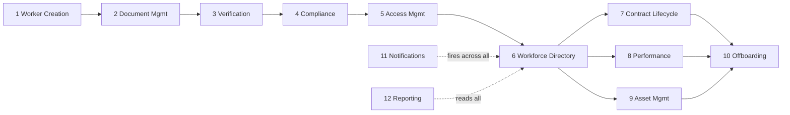

# 05 · Functional Modules

Twelve modules. Each does one job and hands off to the next, which is what turns a set of features into a single workflow.

---

## How they connect

Module 11 (Notifications) and Module 12 (Reporting) are cross cutting: they sit beside every stage rather than inside one.

---

## Module 1 · Worker Creation

- **Purpose:** create the workforce record once an offer is accepted
- **Input:** name, contact, worker type, department, team lead, joining date
- **Output:** Worker ID, profile, type-specific checklist of tasks and documents to complete
- **Roles:** Senior HR

## Module 2 · Document Management

- **Purpose:** collect and store every document
- **Stores:** PAN, Aadhaar, passport, agreements, certificates
- **Output:** a complete, per worker document set, files in Cloud Storage, metadata in Firestore
- **Roles:** worker uploads, HR reviews

## Module 3 · Verification Engine

- **Purpose:** track the verification status of each document
- **Mode:** manual review — Senior HR checks each document visually and marks it
- **Status per document:** Pending, Verified, Rejected
- **On rejection:** an email is sent automatically to the worker with the reason
- **Roles:** Senior HR verifies, HR Executive reviews and flags

## Module 4 · Compliance Engine

- **Purpose:** decide whether a worker is ready to be active
- **Checks:** documents complete, verification complete, agreements signed
- **Output:** ready for activation, or a clear list of what is missing
- **Roles:** system

## Module 5 · Access Management

- **Purpose:** track which systems a worker has been given access to, as a checklist HR ticks off manually
- **How it works:** when a worker is activated, a checklist appears in their record — one checkbox per system (Google Workspace, GitHub, Slack, and any others relevant to their role). Senior HR or IT marks each one as done in WOP after provisioning it manually in the actual system. WOP does not create accounts in any external system.
- **Checklist items (configurable per worker type):** Google Workspace account, GitHub team, Slack workspace, any internal tools
- **Status per item:** Pending, Done
- **At offboarding:** the same checklist reappears as a revocation checklist — every item must be marked revoked before the offboarding can be closed
- **Roles:** Senior HR ticks the checklist

## Module 6 · Workforce Directory

- **Purpose:** the searchable single source of truth for active workers
- **Holds:** current details, department, team lead, location, status, projects
- **Output:** find any worker, see current state and full history
- **Roles:** HR full, Team Lead scoped to team

## Module 7 · Contract Lifecycle

- **Purpose:** manage contractor engagements so none lapses unnoticed
- **Tracks:** SOW, invoices, renewals, expiry alerts at 90, 60, 30, 7 days
- **Output:** live contract status and an end to end invoice flow
- **Roles:** HR manages, contractor submits invoices

## Module 8 · Performance Management

- **Purpose:** track the right reviews for each worker type, on schedule
- **Employee:** 30, 60, 90 day, probation, annual
- **Intern:** weekly, monthly, PPO recommendation
- **Contractor:** delivery evaluation, renewal recommendation
- **Roles:** Team Lead submits, Senior HR oversees

## Module 9 · Asset Management

- **Purpose:** track what hardware a worker holds
- **Tracks:** laptop, monitor, SIM, accessories
- **Output:** a per worker asset list, reconciled at exit
- **Roles:** HR manages

## Module 10 · Offboarding

- **Purpose:** run a clean exit with nothing left open
- **Tracks:** access revocation, asset return, exit documents
- **Rule:** cannot close while any access or asset remains outstanding
- **Roles:** Senior HR runs, Team Lead can request

## Module 11 · Notification Engine

- **Purpose:** send automated emails at key moments in the workflow — nothing more
- **What triggers an email:**

| Trigger | Recipient | Email says |
|---|---|---|
| Document rejected in verification | Worker | Which document was rejected and why, with a re-upload link |
| Onboarding complete and worker activated | Worker + Senior HR | Welcome confirmation, access checklist opened for HR |
| Document not uploaded after 3 days | Worker | Reminder to complete their checklist |
| Contract expiring in 30 days | Senior HR | Contractor name, contract end date, renewal action needed |
| Review due | Team Lead | Which worker's review is due and by when |

- **What it does not do:** no Slack bots, no calendar invites, no automated provisioning triggers, no SMS. Email only.
- **Tech:** SendGrid for delivery, triggered directly from the FastAPI backend on the relevant event — no separate Cloud Functions scheduler needed for these
- **Roles:** system fires emails automatically; no manual action required

## Module 12 · Reporting and Analytics

- **Purpose:** give every audience the view it needs
- **Provides:** HR, contractor, compliance and leadership dashboards
- **Output:** exports to PDF and spreadsheet, plus the append only audit log
- **Roles:** Founder and Senior HR
