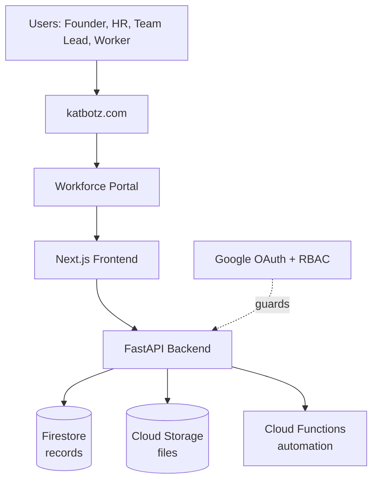
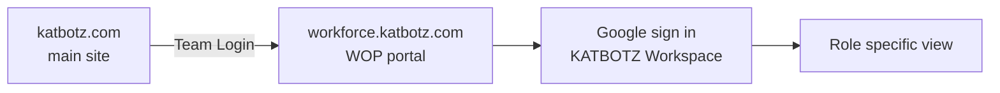

# 06 · System Architecture

## The stack, top to bottom

The path is linear and easy to reason about: a request enters at the domain, the Next.js app renders the right role specific view, FastAPI applies business rules and permissions, and data lands in Firestore for records and Cloud Storage for files. Cloud Functions run the scheduled and event driven jobs off to the side.

---

## Layers and responsibilities

| Layer | Responsibility | Technology |
|-------|----------------|------------|
| Frontend | Role specific dashboards, onboarding and verification portals, directory, self service | Next.js |
| Backend | Business logic, workflow, verification, notifications, access, the permission gate | FastAPI (Python) |
| Database | All structured records: workers, documents metadata, contracts, reviews, audit | Google Firestore |
| Storage | The actual files: PAN, passport, contracts, degrees, NDAs | Google Cloud Storage |
| Automation | Reminders, expiry alerts, scheduled jobs | Google Cloud Functions |
| Auth | Identity and permissions | Google OAuth, role based access control |

---

## Why this stack

| Choice | Why |
|--------|-----|
| Next.js | Fast to build role specific portals, server rendering for a snappy dashboard, large talent pool, responsive on mobile from day one |
| FastAPI | Fast to develop, async ready, automatic API docs, a strong fit for workflow and integration logic |
| Firestore | Serverless, scales automatically, low cost at small scale, flexible schema suits evolving worker data |
| Cloud Storage | Encryption at rest, signed URLs for controlled document access, cheap and durable |
| Cloud Functions | Event and schedule driven, pay per use, ideal for reminders and alerts |
| Google OAuth + RBAC | Staff already live in Google Workspace, so sign in is frictionless; RBAC decides who sees what |

One cloud, one backend language, one frontend framework. Deliberately simple to staff, run and reason about.

---

## Request lifecycle, one example

A worker uploads a PAN card:

1. Browser hits the portal on `katbotz.com`, Next.js serves the worker view.
2. The upload calls a FastAPI endpoint. OAuth confirms identity, RBAC confirms this worker may upload to their own record only.
3. The file streams to Cloud Storage. A signed URL reference, not the file, is what gets stored.
4. A document record is written to Firestore: type, status Pending, expiry if any, and the storage reference.
5. A Cloud Function notes the new item for the verification queue and, later, fires reminders if it stalls.

---

## Environments and engineering practice

> **EDIT ME:** confirm these. They are recommended defaults, not in the source notes.

- Three environments: development, staging, production, kept identical so what is tested is what ships.
- Source control and review on every change (GitHub), with a continuous integration and deployment pipeline.
- Automated tests: unit tests for business logic, integration tests for the verification and compliance flows.
- Monitoring and error tracking so failed uploads or reminders are caught proactively.
- Daily automated backups of Firestore and Cloud Storage, with a tested restore.

---

## API shape

The backend is API first: every capability is an endpoint, so future integrations and automation (see [Integrations](09-integrations-scalability-roadmap.md)) are straightforward.

> **DECISION NEEDED:** REST or GraphQL for the backend API. This document assumes REST via FastAPI for simplicity.

---

## Connecting to katbotz.com

WOP is the **Workforce Portal** for KATBOTZ, reached from the main site. The cleanest way to wire it in:

- **Subdomain.** Host WOP at something like `workforce.katbotz.com`, pointed at Cloud Run with a DNS record at the domain registrar. This keeps WOP independent of whatever the main marketing site runs on, while staying on brand.
- **Entry point.** A simple "Team Login" link in the main site header or footer sends staff and workers to the portal.
- **Sign in.** Staff sign in with Google, restricted to the KATBOTZ Workspace domain. Workers, contractors and interns reach their own portal by secure link or Google sign in, scoped to their own record.
- **One identity.** Because sign in is Google OAuth, there is no separate password to manage and the main site and WOP share the same Google identity.

> **DECISION NEEDED:** what is katbotz.com built on, and do you want WOP as a subdomain (`workforce.katbotz.com`) or a path (`katbotz.com/workforce`). A subdomain is recommended and is what this document assumes. The domain registrar (for example GoDaddy) holds the DNS record that points the subdomain at Cloud Run.
