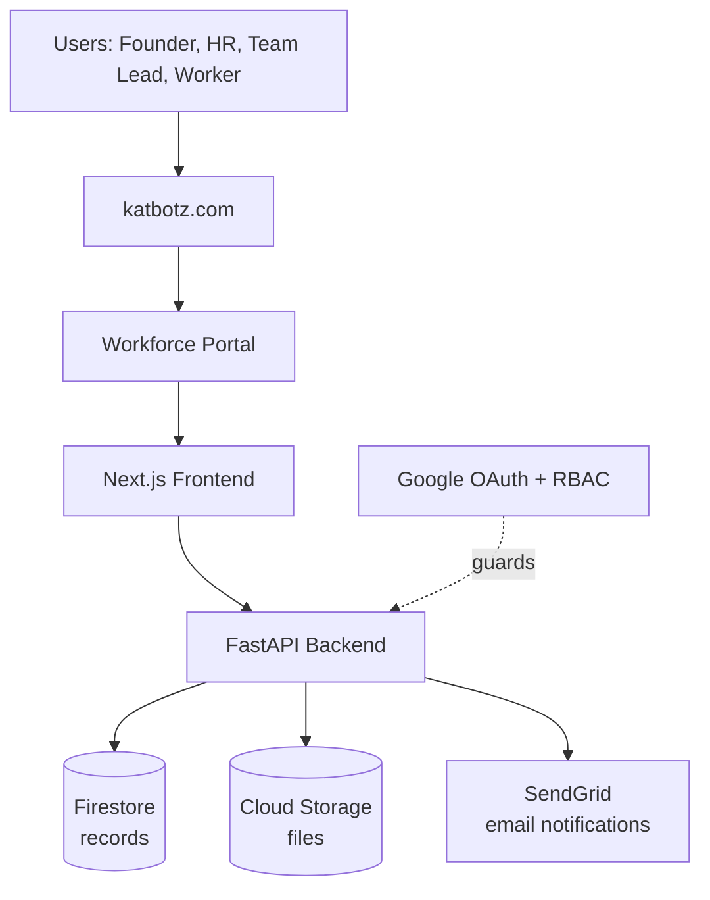
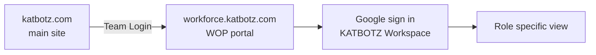

# 06 · System Architecture

## The stack, top to bottom

The path is linear and easy to reason about: a request enters at the domain, the Next.js app renders the right role specific view, FastAPI applies business rules and permissions, and data lands in Firestore for records and Cloud Storage for files. When a key event occurs — a document is rejected, a worker is activated, a contract is expiring — FastAPI calls SendGrid directly to fire the relevant email.

---

## Layers and responsibilities

| Layer | Responsibility | Technology |
|-------|----------------|------------|
| Frontend | Role specific dashboards, onboarding and verification portals, directory, self service | Next.js |
| Backend | Business logic, workflow, verification, notifications, access, the permission gate | FastAPI (Python) |
| Database | All structured records: workers, documents metadata, contracts, reviews, audit | Google Firestore |
| Storage | The actual files: PAN, passport, contracts, degrees, NDAs | Google Cloud Storage |
| Email notifications | Triggered emails on key events (rejection, activation, contract expiry, review due) | SendGrid, called directly from FastAPI |
| Auth | Identity and permissions | Google OAuth, role based access control |

---

## Why this stack

| Choice | Why |
|--------|-----|
| Next.js | Fast to build role specific portals, server rendering for a snappy dashboard, large talent pool, responsive on mobile from day one |
| FastAPI | Fast to develop, async ready, automatic API docs, a strong fit for workflow and integration logic |
| Firestore | Serverless, scales automatically, low cost at small scale, flexible schema suits evolving worker data |
| Cloud Storage | Encryption at rest, signed URLs for controlled document access, cheap and durable |
| SendGrid | Email delivery triggered directly from FastAPI — no separate scheduler needed for the notification events WOP handles |
| Google OAuth + RBAC | Staff already live in Google Workspace, so sign in is frictionless; RBAC decides who sees what |

One cloud, one backend language, one frontend framework. Deliberately simple to staff, run and reason about.

---

## Request lifecycle: document upload and verification

A worker uploads a PAN card:

1. Worker logs in via Google OAuth. Next.js loads their onboarding checklist. They see: ○ PAN card, ○ Aadhaar image, ○ Degree, ○ Relieving letter, ○ Agreements
2. Worker clicks on "PAN card", selects a file from their computer, and clicks [Upload]
3. Browser sends the file to FastAPI backend. OAuth confirms worker identity, RBAC confirms they can only upload to their own record.
4. **File is saved as-is in Cloud Storage** — no processing, no extraction, no transformation. The file becomes an immutable record.
5. FastAPI writes a document record to Firestore: { worker_id, document_type: "PAN", file_path: "gs://...", status: "Pending", uploaded_date: "2026-07-15" }
6. Worker sees in their portal: ✓ PAN uploaded, status: ○ Pending (waiting for HR review)
7. Senior HR opens verification queue and sees: "Rohan Mehta: PAN pending, Aadhaar pending, ..."
8. HR clicks on the Rohan's PAN document, views it (image viewer), and decides:
   - ☑ Verified → Firestore updates: { status: "Verified", verified_by: "Priya", verified_date: "2026-07-16" }. Worker sees ✓ Verified in their portal.
   - ✗ Rejected with reason "blurry" → Firestore updates: { status: "Rejected", rejected_reason: "blurry", rejected_by: "Priya" }. FastAPI triggers SendGrid email to worker with reason and re-upload link.
9. Worker re-uploads → cycle repeats until ☑ Verified
10. Once ALL documents ☑ Verified, compliance gate unlocks and Activate button appears for Senior HR

**Key point:** Documents are stored as files. WOP never reads the file content, extracts data, or sends it to any external service. Documents stay in Cloud Storage as immutable blobs.

---

## Request lifecycle: access creation and tracking

A worker is activated and HR needs to create accounts:

1. Senior HR opens the worker record, sees "Ready for activation", clicks [Activate]
2. FastAPI updates Firestore: { worker_id, status: "Active", access_checklist: [ { system: "Google Workspace", status: "Pending" }, { system: "GitHub", status: "Pending" }, ... ] }
3. Access checklist appears in worker record and in HR's task list
4. HR (or IT person) manually creates accounts in each system:
   - Opens Google Workspace admin console, creates rohan@katbotz.com, sets password, assigns groups
   - Opens GitHub KATBOTZ org, adds rohan as a team member
   - Opens Slack admin, adds rohan@slack.com to KATBOTZ workspace, assigns channels
   - **WOP is not involved in any of these steps.** No API calls, no webhooks, no integrations. All manual in each system.
5. Once the account is created, IT person returns to WOP and ticks ☑ Done:
   - Enters the created email (rohan@katbotz.com) in the Google Workspace field
   - Enters the GitHub username in the GitHub field
   - Clicks ☑ Done
6. FastAPI updates Firestore: { system: "Google Workspace", status: "Done", created_id: "rohan@katbotz.com", created_date: "2026-07-18", created_by: "Priya" }
7. Worker sees in their portal: [2 of 3 systems ready]. Worker can now log in with Google account.
8. When all ☑ Done, HR is notified worker is fully onboarded and ready to work

**Key point:** WOP is a recording system, not an automation system. It tracks what was created manually in other systems. It never creates accounts, sends invites, or integrates with external APIs.

---

## Request lifecycle: access revocation at offboarding

1. Worker exits, last day is August 31. Senior HR clicks [Begin Offboarding]
2. FastAPI creates a revocation checklist in Firestore: { system: "Google Workspace", status: "Pending", action: "revoke" }, etc.
3. HR (or IT) manually revokes access in each system:
   - Google Workspace admin: suspends rohan@katbotz.com, removes from all groups
   - GitHub: removes rohan from KATBOTZ org
   - Slack: deactivates rohan account
4. HR returns to WOP and ticks ☑ Revoked for each system
5. FastAPI updates Firestore: { system: "Google Workspace", status: "Revoked", revoked_date: "2026-08-31", revoked_by: "Priya" }
6. HR collects physical assets (laptop, monitor, SIM), ticks ☑ Returned
7. HR confirms exit interview and relieving letter, ticks ☑ Complete
8. Once all ☑, offboarding is finalized. Worker record moves to Archive stage.

**Key point:** Same principle. WOP records the revocation checklist, but IT does the actual revocation in each system.

---

## Environments and engineering practice

> These are the engineering practices I am building to. Confirming them before week 1 would be ideal.

- Three environments: development, staging, production, kept identical so what is tested is what ships.
- Source control and review on every change (GitHub), with a continuous integration and deployment pipeline.
- Automated tests: unit tests for business logic, integration tests for the verification and compliance flows.
- Monitoring and error tracking so failed uploads or reminders are caught proactively.
- Daily automated backups of Firestore and Cloud Storage, with a tested restore.

---

## API shape

The backend is API first: every capability is an endpoint, so future integrations and automation (see [Integrations](09-integrations-scalability-roadmap.md)) are straightforward.

> **Confirmed:** REST via FastAPI. Simple, well-documented, and the right fit for this workflow.

---

## Connecting to katbotz.com

WOP is the **Workforce Portal** for KATBOTZ, reached from the main site. The cleanest way to wire it in:

- **Subdomain.** Host WOP at something like `workforce.katbotz.com`, pointed at Cloud Run with a DNS record at the domain registrar. This keeps WOP independent of whatever the main marketing site runs on, while staying on brand.
- **Entry point.** A simple "Team Login" link in the main site header or footer sends staff and workers to the portal.
- **Sign in.** Everyone signs in with Google OAuth, restricted to the KATBOTZ Workspace domain. A Google Workspace account is part of the access checklist in M5 — no account, no entry. Once signed in, the role determines what they see.
- **One identity.** Because sign in is Google OAuth, there is no separate password to manage and the main site and WOP share the same Google identity.

> **Confirmed:** WOP will be hosted at `workforce.katbotz.com`. A DNS record at the domain registrar points the subdomain at Cloud Run.
