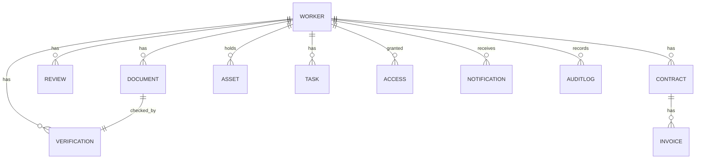

# 07 · Database Architecture

> The most important architectural concept in the system: **one Worker, many attached modules.** Everything hangs off the Worker.



---

## Where every byte lives

Two stores, both on Google Cloud. A record points to its file. Nothing lives in Sheets or Drive anymore.

| What | Saved in | How it is held |
|------|----------|----------------|
| Structured records | **Firestore** | Worker, document metadata, verification, contract, invoice, review, asset, task, access, notification, audit log |
| Uploaded files | **Cloud Storage** | PAN, Aadhaar reference, passport, degrees, experience letters, signed agreements, bank proof |
| Access to files | **Cloud Storage** | Encrypted at rest, reached only through short lived signed URLs, never a public link |
| Backups | Firestore and Storage | Daily automated backup with a tested restore |
| Audit trail | **Firestore** | Append only, every sensitive action, never overwritten |

The rule of thumb: **records in Firestore, files in Storage, and the record carries the pointer to the file.**

---

## Entities

| Entity | Stores | Links to |
|--------|--------|----------|
| Worker | Profile, type, status, department, team lead, location, lifecycle state | documents, verifications, reviews, contracts, assets, tasks, access |
| Document | File path (e.g. gs://bucket/worker-123/pan.pdf), type (PAN, Aadhaar, etc.), verification status (Pending / Verified / Rejected), rejection reason if any, uploaded date, verified date | a worker |
| Verification | Category, status, reviewer, timestamp | a worker, a document |
| Contract | Agreement, SOW, NDA, start, end, renewal, payment terms | a contractor, many invoices |
| Invoice | Amount, status, submitted and paid dates | a contract |
| Review | Type, due date, outcome, reviewer | a worker |
| Asset | Item, serial, issued date, returned date | a worker |
| Task | Description, owner, due date, status | a worker |
| Access | System, status, requested and revoked dates | a worker |
| Notification | Event, recipient, channel, sent timestamp | a worker or contract |
| Audit log | User, activity, timestamp, status | any entity (append only) |

---

## Firestore collection shape

A practical layout. Sub collections keep a worker and everything attached to them together, which suits the "everything attaches to Worker" model.

```
workers/{workerId}
  ├── (worker fields)
  ├── documents/{documentId}
  ├── verifications/{verificationId}
  ├── reviews/{reviewId}
  ├── contracts/{contractId}
  │     └── invoices/{invoiceId}
  ├── assets/{assetId}
  ├── tasks/{taskId}
  ├── access/{accessId}
  └── notifications/{notificationId}

auditLogs/{logId}        (top level, append only, references workerId)
```

> **Confirmed:** sub collections under each worker for worker-scoped data, plus a few top-level collections for cross-cutting queries (audit log, all contracts for expiry scanning).

### Firestore Field Definitions

**Worker Document (workers/{workerId}):**
```
name: string (required, e.g. "Rohan Mehta")
email: string (required, unique index, e.g. "rohan@katbotz.com")
phone: string (optional)
dob: date (optional)
type: enum ["Indian Employee", "Indian Contractor", "Global Contractor", "Global Intern"]
status: enum ["Created", "Onboarding", "Verification", "Compliance", "Activation", "Active", "Offboarding", "Archive", "Deletion"]
joining_date: date
last_day: date (null unless offboarding)
department: string (indexed for searches, e.g. "Engineering")
team_lead: string (reference to workerId, indexed)
location: string (indexed, e.g. "Bangalore")
gusto_id: string (reference to Gusto, for payroll verification)
zoho_recruit_id: string (reference to Zoho hiring)
created_at: timestamp
updated_at: timestamp
verified_at: timestamp (null if not verified)
activated_at: timestamp (null if not activated)
archived_at: timestamp (null if not archived)
legal_hold_until: date (null unless under legal hold)
migration_source: string (null or "sheets" if migrated from Sheets)
notes: string (internal HR notes)

Indexes (composite):
  - (type, status) — for filtering by worker type and status
  - (department, status) — for department views
  - (team_lead, status) — for Team Lead to see their team
  - (email) — unique constraint
```

**Document Record (workers/{workerId}/documents/{documentId}):**
```
type: enum ["PAN", "Aadhaar", "Passport", "Degree", "Relieving Letter", "Employment Agreement", "NDA", "Bank Proof", ...]
file_path: string (gs://bucket/worker-id/document-id.pdf)
file_name: string (original filename uploaded)
file_size_bytes: number
mime_type: string (application/pdf, image/jpeg, etc.)
uploaded_by: string (workerId)
uploaded_at: timestamp
uploaded_version: number (1, 2, 3 if re-uploaded)
status: enum ["Pending", "Verified", "Rejected", "Clarification Requested"]
verified_by: string (Senior HR user ID, null if not verified)
verified_at: timestamp (null if not verified)
rejected_reason: string (max 500 chars, null if not rejected)
clarification_requested_reason: string (null unless status = "Clarification Requested")
expiry_date: date (null if non-expiring document)
renewal_notice_sent: boolean
compliance_required: boolean (true if required for activation gate)

Indexes (composite):
  - (status) — for verification queue
  - (type, status) — for compliance check queries
```

**Access Checklist (workers/{workerId}/access/{systemId}):**
```
system_name: string ("Google Workspace", "GitHub", "Slack", "Notion")
created_id: string (rohan@katbotz.com, rohan-github, etc.)
status: enum ["Pending", "Done"]
created_by: string (HR or IT user ID)
created_at: timestamp
revocation_status: enum [null, "Pending", "Revoked"]
revoked_at: timestamp (null if not revoked)
revoked_by: string (user ID)

Index:
  - (status) — for showing pending access during activation
```

**Audit Log (auditLogs/{logId}, top-level, append-only):**
```
worker_id: string (references workers/{workerId})
action: enum [
  "worker_created", "document_uploaded", "document_verified", "document_rejected",
  "clarification_requested", "compliance_checked", "access_created", "access_revoked",
  "worker_activated", "offboarding_started", "offboarding_cancelled", "worker_archived",
  "worker_deleted", "review_scheduled", "review_completed", "legal_hold_applied",
  "legal_hold_released"
]
performed_by: string (user ID)
performed_at: timestamp
details: object {
  document_id: string (if relevant),
  status_before: string (if status changed),
  status_after: string (if status changed),
  reason: string (if action was rejected/cancelled),
  system_name: string (if access action)
}
ip_address: string (for security audit trail)

Index:
  - (worker_id, performed_at DESC) — full history for one worker
  - (action, performed_at DESC) — all actions of one type
  - (performed_at DESC) — append-only journal
```

### Query Patterns & Cost Estimates

```
Q1: Verification queue for Senior HR
  db.collection('workers').where('status', '==', 'Verification')
    .orderBy('updated_at', 'desc').limit(20)
  Cost: 1 read + 20 sub-collection reads (documents) = ~21 reads

Q2: Compliance check (all docs verified + agreements signed)
  db.collection('workers').doc(workerId).collection('documents')
    .where('compliance_required', '==', true).get()
  Cost: 1 read per document type (e.g., 6 reads for 6 required docs)

Q3: Directory search (employees by department)
  db.collection('workers').where('department', '==', 'Engineering')
    .where('status', '==', 'Active').orderBy('name').limit(50)
  Cost: 1 read (composite index exists)

Q4: Audit trail for one worker
  db.collection('auditLogs').where('worker_id', '==', workerId)
    .orderBy('performed_at', 'desc').get()
  Cost: 1 read per log entry (~100 entries per worker lifetime)

Per-worker storage estimate: ~70 KB (profile + documents + audit)
At 500 workers: 35 MB total, ~500 queries/day, ~$5–10/month cost
At 5,000 workers: 350 MB total, ~2,000 queries/day, ~$15–30/month cost
```

---

## Search and indexing

- The Workforce Directory needs fast filter by type, department, team lead, location and status.
- Firestore composite indexes cover the common filters.
- For free text search across names and documents, consider a search index later if Firestore queries are not enough.

> **Confirmed:** filter plus prefix match at launch. Full text search can be added later if Firestore composite indexes are not enough at scale.

---

## Retention and deletion

Tied to the lifecycle (see [Workforce Lifecycle](04-workforce-lifecycle.md), Stage 9).

- On archival, the retention clock starts.
- After the retention period, the system deletes documents, personal data and banking data.
- Anonymized analytics are kept, so headcount and trend history survive deletion.

> **Pending legal confirmation:** retention period assumed at 3 years after archival. Confirm before go-live.

---

## Where everything is stored and how to access it

### Worker Data
- **Stored in:** Firestore (records database)
- **What:** Name, email, worker type, department, team lead, joining date, status, lifecycle stage
- **How to access:** WOP portal (login → view worker profile, or search in Workforce Directory)
- **Who can access:** Senior HR (all), HR Executive (all), Team Lead (their team only), Founder (all, read-only), Worker (themselves only)

### Documents (files)
- **Stored in:** Google Cloud Storage (file storage)
  - Regular documents (PAN, degree, passport): `documents-bucket/worker-id/document-name.pdf`
  - Aadhaar image: `locked-aadhaar-bucket/worker-id/aadhaar.jpg` (locked, 30-sec signed URL only)
- **What:** Uploaded files, stored exactly as-is (no processing)
- **How to access:** WOP portal → open worker → Documents tab → click on document → view in browser
- **Who can access:** Senior HR (views all), Worker (views own), HR Executive (views all, review-only)

### Document Metadata & Status
- **Stored in:** Firestore (records database)
- **What:** Document type, upload date, verification status (Pending/Verified/Rejected), verified by, verified date, rejection reason
- **How to access:** WOP portal → Verification queue or Worker profile
- **Who can access:** Senior HR (all), HR Executive (all, read-only), Worker (their own)

### Contracts & Invoices
- **Stored in:** Firestore (records) + Cloud Storage (contract PDF files)
- **Records:** Start date, end date, renewal date, payment terms, status (Active/Expiring/Expired)
- **Files:** Contract SOW/NDA PDFs stored in Cloud Storage
- **How to access:** WOP portal → Contracts tab or Worker profile
- **Expiry alerts:** Automatic email at 90, 60, 30, 7 days before expiry

### Reviews & Performance
- **Stored in:** Firestore (records)
- **What:** Review type (30-day, 60-day, 90-day, probation, annual, weekly), due date, completion date, reviewer, outcome
- **How to access:** WOP portal → Performance tab or Worker profile
- **Who can access:** Team Lead (submits), Senior HR (views all), Worker (views their own)

### Assets (Laptops, Monitors, SIM, etc.)
- **Stored in:** Firestore (records)
- **What:** Item description, serial number, issued date, returned date, condition
- **How to access:** WOP portal → Assets tab or Worker profile
- **Who can access:** HR (tracks), Worker (views own)

### Audit Log (Append-only)
- **Stored in:** Firestore (top-level `auditLogs` collection)
- **What:** User, action, timestamp, status (who changed what, when)
  - Example: "Priya verified Rohan's PAN card on 2026-07-16 10:23 AM"
  - Example: "Rohan uploaded Aadhaar image on 2026-07-15 2:45 PM"
  - Example: "Rohan rejected for Aadhaar blurry on 2026-07-16 10:30 AM"
- **How to access:** WOP portal → Audit Log view (HR only)
- **Who can access:** Senior HR, Founder (read-only)
- **Cannot be edited:** Append-only (new entries only, never deleted or modified)

### Reports & Analytics
- **Stored in:** Generated on-demand in WOP, exported by HR
- **What:** Headcount, hiring trends, worker status breakdown, contract expiry calendar, overdue documents, review schedule
- **How to access:** WOP portal → Reports tab → view charts, or [Export to CSV] or [Export to PDF]
- **Export goes to:** User's computer (downloads as CSV or PDF file)
- **Optional:** HR can save exported reports to Google Drive or Sheets manually if needed

---

## Optional: Sheets as a Quick Reference Index

**Idea:** Keep Google Sheets as a quick-reference index with links to WOP, for the transition period (Sept 1 - Dec 1, for example).

**How it would work:**

Sheets has one row per worker:
| Name | Email | Worker Type | Department | Team Lead | Status | View in WOP |
|---|---|---|---|---|---|---|
| Rohan Mehta | rohan@katbotz.com | Indian Employee | Engineering | Akshat | Active | [Link to WOP] |
| Sara Lim | sara@katbotz.com | Global Intern | Product | Akshat | Active | [Link to WOP] |

Each "View in WOP" link is a formula like:
```
=HYPERLINK("https://workforce.katbotz.com/workers/WOP-2026-0041", "View")
```

**Benefits:**
- Quick visual reference (see all names, status at a glance)
- No manual data entry (data stays in WOP, only the link lives in Sheets)
- Bridges the gap while people are still familiar with Sheets
- Can be deleted once everyone is trained on WOP

**Phase-out plan:**
- Sept 1 - Sept 30: Keep Sheets as convenience reference, HR uses WOP for all work
- Oct 1 onwards: Sheets becomes optional, most people switch to WOP
- Dec 1: Archive Sheets as read-only backup history

**Will this be built?**
Not in the initial platform (July 1 - Aug 22). This can be set up manually after go-live if you want it. One person can create the Sheets index + links in 1-2 hours once WOP is live.

---

## Summary: Three Storage Tiers

| Tier | What | Where | Who can access | Backup? |
|---|---|---|---|---|
| **Tier 1: Critical Data** | Worker records, documents, contracts, audit log | Firestore | Auth-controlled per role | Daily exports to backup bucket |
| **Tier 2: Files** | Uploaded documents (PAN, passport, etc) | Cloud Storage | Auth-controlled per role | Daily snapshots, 30-day versioning |
| **Tier 3: Aadhaar** | Aadhaar image only (locked) | Locked Cloud Storage | Senior HR only, 30-sec links | Daily snapshots, 30-day versioning |
| **Tier 4: Exports** | CSV/PDF reports (on-demand) | User's computer | HR downloads | Optional: HR saves to Drive |
