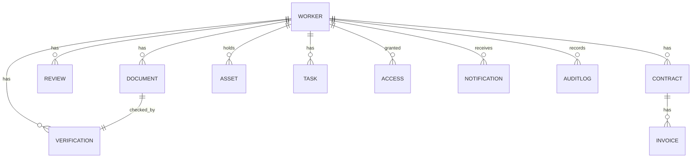

# 07 · Database Architecture

> The most important architectural concept in the system: **one Worker, many attached modules.** Everything hangs off the Worker.



---

## Where every byte lives

Two stores, both on Google Cloud. A record points to its file. Nothing lives in Sheets or Drive anymore.

| What | Saved in | How it is held |
|------|----------|----------------|
| Structured records | **Firestore** | Worker, document metadata, verification, contract, invoice, review, asset, task, access, notification, audit log |
| Uploaded files | **Cloud Storage** | PAN, Aadhaar reference, passport, degrees, experience letters, signed agreements, bank proof |
| Access to files | **Cloud Storage** | Encrypted at rest, reached only through short lived signed URLs, never a public link |
| Backups | Firestore and Storage | Daily automated backup with a tested restore |
| Audit trail | **Firestore** | Append only, every sensitive action, never overwritten |

The rule of thumb: **records in Firestore, files in Storage, and the record carries the pointer to the file.**

---

## Entities

| Entity | Stores | Links to |
|--------|--------|----------|
| Worker | Profile, type, status, department, manager, location, lifecycle state | documents, verifications, reviews, contracts, assets, tasks, access |
| Document | File reference, type, verification status, expiry date | a worker, a verification |
| Verification | Category, status, reviewer, timestamp | a worker, a document |
| Contract | Agreement, SOW, NDA, start, end, renewal, payment terms | a contractor, many invoices |
| Invoice | Amount, status, submitted and paid dates | a contract |
| Review | Type, due date, outcome, reviewer | a worker |
| Asset | Item, serial, issued date, returned date | a worker |
| Task | Description, owner, due date, status | a worker |
| Access | System, status, requested and revoked dates | a worker |
| Notification | Event, recipient, channel, sent timestamp | a worker or contract |
| Audit log | User, activity, timestamp, status | any entity (append only) |

---

## Firestore collection shape

A practical layout. Sub collections keep a worker and everything attached to them together, which suits the "everything attaches to Worker" model.

```
workers/{workerId}
  ├── (worker fields)
  ├── documents/{documentId}
  ├── verifications/{verificationId}
  ├── reviews/{reviewId}
  ├── contracts/{contractId}
  │     └── invoices/{invoiceId}
  ├── assets/{assetId}
  ├── tasks/{taskId}
  ├── access/{accessId}
  └── notifications/{notificationId}

auditLogs/{logId}        (top level, append only, references workerId)
```

> **DECISION NEEDED:** sub collections under each worker, or top level collections keyed by workerId. Sub collections read naturally per worker; top level collections make cross worker queries (for example "all expiring contracts") simpler. A common answer is sub collections for worker scoped data plus a few top level collections for cross cutting queries (audit log, all contracts).

---

## Search and indexing

- The Workforce Directory needs fast filter by type, department, manager, location and status.
- Firestore composite indexes cover the common filters.
- For free text search across names and documents, consider a search index later if Firestore queries are not enough.

> **EDIT ME:** decide if launch needs full text search, or whether filter plus prefix match is enough for the first 500 workers.

---

## Retention and deletion

Tied to the lifecycle (see [Workforce Lifecycle](04-workforce-lifecycle.md), Stage 9).

- On archival, the retention clock starts.
- After the retention period, the system deletes documents, personal data and banking data.
- Anonymized analytics are kept, so headcount and trend history survive deletion.

> **EDIT ME:** retention period assumed at **3 years**. Confirm with the DPDP position in [Security](08-security-and-compliance.md).
