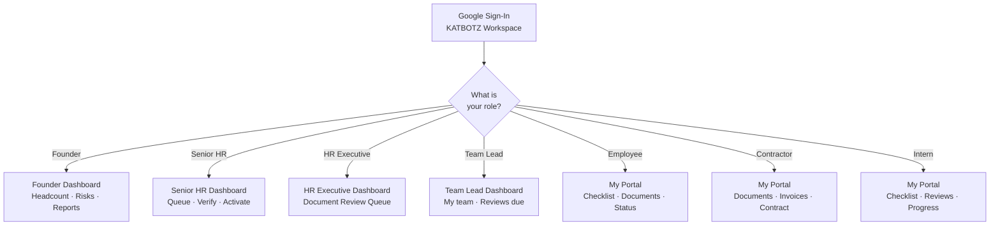
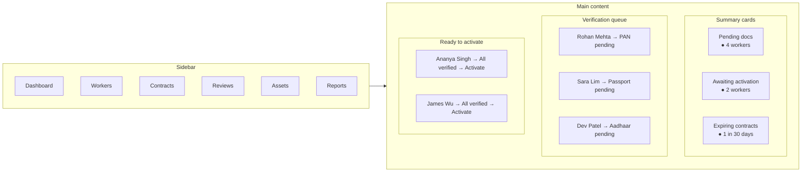
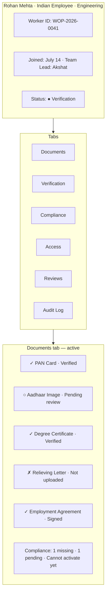
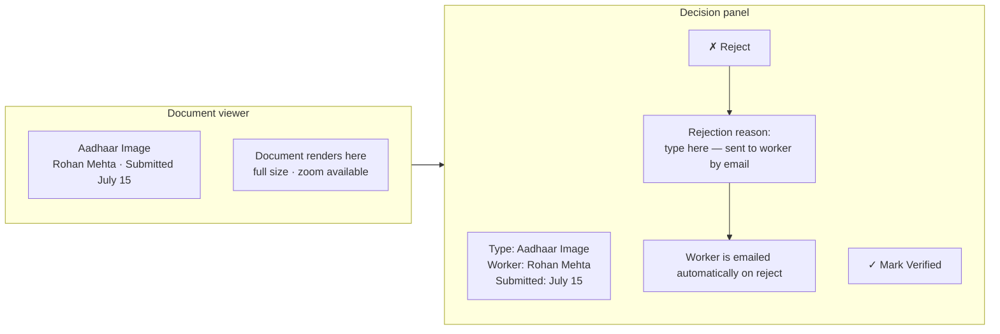
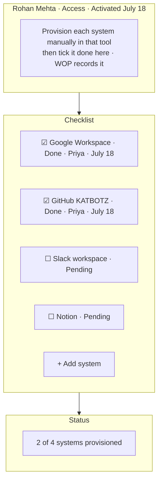
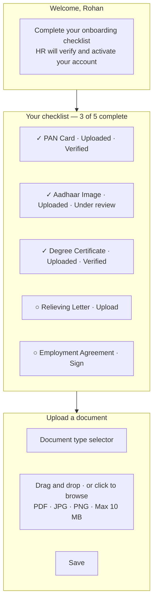
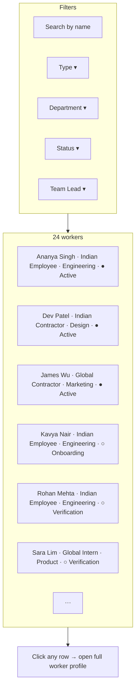
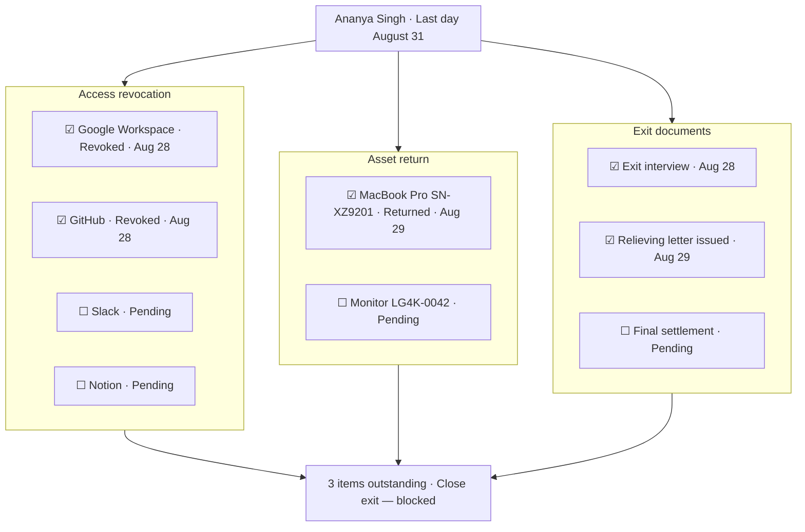
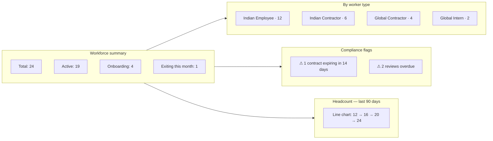
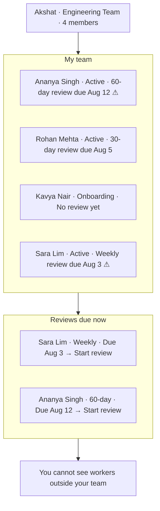

# 11 · Screen Mockups

Rough visual layouts for every key screen. These show structure and navigation — not final design. Built in Next.js during the build phase from July 1.

---

## Navigation and role routing

When someone logs in, Google OAuth confirms their identity and their role determines which dashboard they land on. The same app, a different entry point for every role.

---

## Senior HR Dashboard

The main operational screen. Everything that needs attention today, in one place.

---

## Worker Profile

The full record for one worker. Every module is a tab on this page.

---

## Document Verification

HR opens a document from the queue and makes a decision. Rejection triggers an automatic email to the worker.

---

## Access Management Checklist

After a worker is activated, this checklist appears. HR ticks each system after IT provisions it manually. The same list becomes the revocation checklist at offboarding.

---

## Worker Self-Service Portal

What the worker sees when they log in during onboarding. Their only job here is to upload documents and sign agreements.

---

## Workforce Directory

The searchable single source of truth. HR sees everyone. Team Leads see their team only.

---

## Offboarding Checklist

The exit cannot be closed while any item is outstanding. Every access revoked, every asset returned, every document signed — then and only then does the record move to archive.

---

## Founder Dashboard

Read-only. Health, risk flags, and headcount trends. No buttons to change anything.

---

## Team Lead View

Scoped to their team. The only things a Team Lead can do are submit reviews and request offboarding.

---

*Layouts are indicative. Final screens designed and built in Next.js during the build phase, July 1 onwards.*
